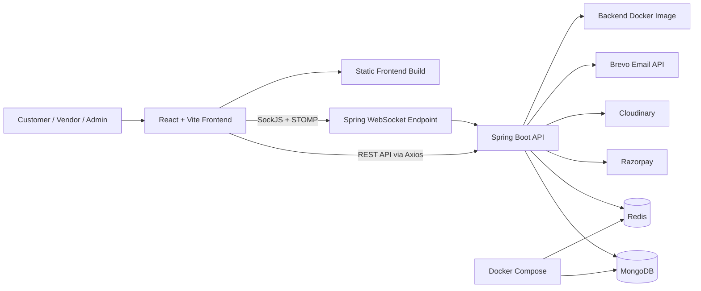

# ApexHK Marketplace

ApexHK Marketplace is a full-stack multi-vendor e-commerce application with separate experiences for customers, vendors, and administrators. Customers can browse the public catalog, search and filter products, manage a cart, place orders, use wallet balance, track fulfillment, submit reviews, and raise return requests.

Vendors get a dedicated portal for store profile management, product listing, order fulfillment, return processing, earnings, payout requests, and subscription plans. Administrators can review vendor applications, manage users, products, categories, coupons, promotional banners, payouts, orders, and return appeals.

The project is implemented as a React/Vite frontend backed by a Spring Boot REST API. MongoDB stores application data, Redis supports cache and JWT revocation, Razorpay handles checkout-related payments, Cloudinary stores uploaded images, Brevo sends transactional emails, and WebSocket/STOMP notifications keep users updated in real time.

## Key Features

### Customer

- Customer registration and login with JWT access/refresh tokens.
- Public product browsing by catalog, category, featured products, search, and product details.
- Cart management with add, update, remove, and clear operations.
- Checkout with shipping address selection, coupon validation, wallet usage, and Razorpay payment order creation.
- Order history and order detail pages.
- Wallet balance, wallet transaction history, and Razorpay-backed wallet top-ups.
- Product reviews with optional uploaded images.
- Return requests for delivered order items within the implemented return window.
- Return appeal flow after vendor rejection.
- Real-time and persisted notifications.

### Vendor

- Vendor registration as an application flow requiring admin approval.
- Vendor store profile updates, including logo upload.
- Product creation, editing, soft deletion, image upload, stock, categories, tags, brand, SKU, specifications, featured flag, and flash sale pricing.
- Subscription plan management with free and paid Razorpay-backed plans.
- Product limit and commission logic tied to vendor subscription plan.
- Vendor-scoped order list, order stats, fulfillment status updates, tracking/shipping details, and delivery OTP verification.
- Vendor-scoped return dashboard with review, approval/rejection, pickup scheduling, warehouse receipt, quality check, refund initiation, and refund completion.
- Earnings tracking and payout request history.

### Admin

- Admin dashboard statistics and recent order data.
- User management, including account active/inactive toggling.
- Vendor application review, approval, rejection, and commission updates.
- Product visibility and deletion management.
- Category approval/rejection workflow for vendor-requested categories.
- Coupon creation, listing, activation toggling, deletion, and customer coupon validation.
- Promotional banner creation with image upload, placement, display order, expiry, toggling, and deletion.
- Order listing and admin order views.
- Payout approval/rejection.
- Return analytics and appeal resolution.

### Platform

- Multi-vendor order splitting into vendor-specific order portions.
- Vendor-scoped authorization for order and return data.
- Stock deduction and rollback logic around checkout/payment failure.
- Coupon usage tracking with server-side validation.
- Razorpay checkout verification, wallet top-up verification, subscription verification, and webhook fallback handling.
- Transactional emails for vendor application status, order status updates, delivery OTP, and refunds.
- WebSocket/STOMP notifications with persisted notification history and unread counts.

## Tech Stack

| Area | Technologies verified in the project |
| --- | --- |
| Frontend | React 18, TypeScript, Vite, React Router, TanStack Query, Zustand, Axios, Tailwind CSS, Framer Motion, Recharts, React Hot Toast, Lucide React, Zod |
| Backend | Java 21, Spring Boot 3.5, Spring Web, Spring Security, Spring Data MongoDB, Spring Data Redis, Spring Cache, Spring WebSocket, Spring Validation, Spring Actuator, Thymeleaf, SpringDoc OpenAPI |
| Database | MongoDB |
| Cache/session/security infrastructure | Redis, JWT access/refresh tokens, Redis-backed JWT blacklist, BCrypt password hashing, Spring Security method/web authorization |
| External services | Razorpay, Cloudinary, Brevo SMTP API |
| Deployment/infrastructure | Backend Dockerfile, Docker Compose for local MongoDB/Redis, Vite static frontend build, SPA `_redirects` file |

## System Architecture



## Main Application Flows

### Customer Registration/Login

Customers register with name, email, password, and role. Customer accounts are created active and email-verified in the current registration path, then authenticated through Spring Security using BCrypt password verification. Login returns a JWT access token, refresh token, token type, expiry metadata, and user profile details.

Vendors use the same registration endpoint with vendor store details, but their account remains gated until admin approval.

### Customer Shopping/Order Flow

Customers browse public products, add products to the cart, choose a saved address, optionally apply a coupon and wallet balance, then start checkout. The backend validates stock, creates an order, splits it into vendor-specific order portions, atomically deducts stock, deducts wallet funds if used, and creates a Razorpay order when an external payment amount remains.

After successful payment verification, the backend confirms the parent order and vendor order portions, clears the cart, updates vendor earnings, sends notifications, and sends an order confirmation email.

### Vendor Application/Approval Flow

Vendor registration creates a pending vendor profile and sends an application-received email. Admins review pending vendors and can approve or reject them. Approval activates the user account, applies the default free plan when needed, notifies the vendor, and sends an approval email. Rejection stores a reason, notifies the vendor, and sends a rejection email.

### Vendor Product/Order Management

Approved vendors can create and update products with Cloudinary-backed image uploads. Product creation enforces active category validation and subscription product limits. Vendors can view only their own products and their own portion of multi-vendor orders.

For fulfillment, vendors progress their order portion through the allowed status transitions, add tracking/shipping details, generate delivery OTPs for customers, and verify OTPs before delivery completion.

### Payment Flow

The application uses Razorpay for order payments, wallet top-ups, and paid vendor subscription plans. The backend creates Razorpay orders server-side and verifies returned payment signatures before confirming orders, crediting wallets, or activating subscriptions.

A dedicated Razorpay webhook endpoint verifies the `X-Razorpay-Signature` header against the raw request body. The webhook handles `payment.captured` as a server-to-server fallback for checkout orders, wallet top-ups, and vendor subscriptions.

### Return/Refund Flow

Customers can raise returns for delivered order items within the implemented seven-day return window and can attach evidence images. Vendors review returns, approve or reject them, schedule pickup, mark pickup and warehouse receipt, run quality checks, initiate refunds, and complete refunds.

Refund completion supports original-payment refunds through Razorpay when a payment ID exists, with wallet credit fallback. Wallet credit and store-credit paths are represented as wallet credits. Stock restoration and vendor earning reversal are guarded to avoid duplicate side effects.

### Email Notification Flow

Email notifications are rendered with Thymeleaf templates and sent through the Brevo SMTP API. Implemented email types include vendor application received, vendor approval/rejection, order confirmation, shipped, out-for-delivery, delivered, cancelled, delivery OTP, and refund confirmation.

### Real-Time Notification Flow

The backend persists notifications in MongoDB and sends them over Spring WebSocket/STOMP using `SimpMessagingTemplate`. The frontend connects through SockJS/STOMP using the JWT access token and subscribes to `/user/queue/notifications`. Incoming notifications update the unread badge, display a toast, and invalidate relevant order queries.

## Security

- JWT-based stateless authentication with access and refresh tokens.
- JWT signing secret loaded from environment configuration and validated at startup.
- BCrypt password hashing with strength 12.
- Role-based authorization for customer, vendor, admin, shared, and public endpoint groups.
- Method-level authorization enabled with Spring Security.
- Redis-backed JWT blacklist for logout and revoked token checks.
- Redis fail-closed behavior for JWT blacklist checks in the authentication filter and WebSocket handshake.
- CORS configured from environment variables with wildcard origins rejected when credentials are enabled.
- Security headers configured through Spring Security, including Content Security Policy, same-origin frame options, referrer policy, and HSTS.
- Razorpay server-side payment signature verification for checkout, wallet top-up, and subscription confirmation.
- Dedicated Razorpay webhook signature verification using the raw payload and `X-Razorpay-Signature`.
- Delivery OTP generation with expiry, failed-attempt lockout configuration, and vendor-scoped order portions.
- Bean Validation annotations on request DTOs for required fields, email format, size, positive values, and structured request validation.
- Auth endpoint rate limiting for login, registration, and token refresh.
- SpringDoc/Swagger can be disabled through `SPRINGDOC_ENABLED`.
- Secrets and integration credentials are loaded from environment variables or `.env` property imports.

## Project Structure

```text
ApexHK/
├── README.md
├── docker-compose.yml
├── screenshots/
├── marketplace backend/
│   ├── Dockerfile
│   ├── pom.xml
│   ├── .env.example
│   └── src/
│       ├── main/
│       │   ├── java/com/marketplace/
│       │   │   ├── config/
│       │   │   ├── controller/
│       │   │   ├── dto/
│       │   │   ├── enums/
│       │   │   ├── exception/
│       │   │   ├── model/
│       │   │   ├── repository/
│       │   │   ├── security/
│       │   │   ├── service/
│       │   │   └── util/
│       │   └── resources/
│       │       ├── application.properties
│       │       ├── application-dev.properties
│       │       └── templates/
│       └── test/java/com/marketplace/
└── marketplace-frontend/
    ├── package.json
    ├── vite.config.ts
    ├── vitest.config.ts
    ├── tailwind.config.js
    ├── .env.example
    ├── _redirects
    └── src/
        ├── components/
        ├── lib/
        ├── pages/
        │   ├── admin/
        │   ├── auth/
        │   ├── customer/
        │   ├── public/
        │   └── vendor/
        ├── router/
        ├── stores/
        ├── test/
        └── types/
```

## Local Development Setup

### 1. Clone the Repository

```bash
git clone <repository-url>
cd ApexHK
```

### 2. Start MongoDB and Redis

```bash
docker compose up -d
```

The provided Compose file starts:

- MongoDB on `127.0.0.1:27017`
- Redis on `127.0.0.1:6379`

### 3. Configure Backend Environment Variables

Create `marketplace backend/.env` from `marketplace backend/.env.example` and fill in local placeholders only:

```properties
MONGODB_URI=mongodb://localhost:27017/marketplace
JWT_SECRET=<strong-32-byte-minimum-secret>
RAZORPAY_MODE=test
RAZORPAY_KEY_ID=<razorpay-test-key-id>
RAZORPAY_KEY_SECRET=<razorpay-test-key-secret>
RAZORPAY_WEBHOOK_SECRET=<razorpay-webhook-secret>
CLOUDINARY_CLOUD_NAME=<cloudinary-cloud-name>
CLOUDINARY_API_KEY=<cloudinary-api-key>
CLOUDINARY_API_SECRET=<cloudinary-api-secret>
BREVO_API_KEY=<brevo-api-key>
MAIL_FROM=<verified-sender-email>
REDIS_URL=redis://localhost:6379
```

### 4. Start the Backend

```bash
cd "marketplace backend"
./mvnw spring-boot:run
```

On Windows PowerShell:

```powershell
cd "marketplace backend"
.\mvnw.cmd spring-boot:run
```

The API defaults to `http://localhost:8080`.

### 5. Configure Frontend Environment Variables

Create `marketplace-frontend/.env` from `marketplace-frontend/.env.example`:

```properties
VITE_API_BASE_URL=http://localhost:8080
VITE_WS_URL=http://localhost:8080/ws
VITE_RAZORPAY_KEY_ID=<razorpay-test-key-id>
```

### 6. Start the Frontend

```bash
cd marketplace-frontend
npm install
npm run dev
```

The Vite dev server defaults to `http://localhost:5173`.

## Environment Variables

### Backend

| Variable | Purpose |
| --- | --- |
| `PORT` | Backend server port, defaulting to `8080`. |
| `MONGODB_URI` | MongoDB connection URI. |
| `JWT_SECRET` | JWT signing secret; must be configured and at least 32 bytes. |
| `JWT_ACCESS_EXPIRY` | Access token lifetime in milliseconds. |
| `JWT_REFRESH_EXPIRY` | Refresh token lifetime in milliseconds. |
| `APP_CORS_ALLOWED_ORIGINS` | Comma-separated frontend origins allowed by CORS. |
| `CORS_ALLOWED_ORIGINS` | Legacy/fallback CORS origin variable supported by configuration. |
| `APP_CORS_REQUIRE_EXPLICIT_CONFIG` | Enables fail-closed behavior when CORS origins are missing. |
| `FRONTEND_URL` | Frontend URL used for generated links such as email verification links. |
| `CLOUDINARY_CLOUD_NAME` | Cloudinary cloud name for image uploads. |
| `CLOUDINARY_API_KEY` | Cloudinary API key. |
| `CLOUDINARY_API_SECRET` | Cloudinary API secret. |
| `RAZORPAY_MODE` | Razorpay mode, such as `test` or `live`. |
| `RAZORPAY_KEY_ID` | Razorpay key ID used by backend-created payment orders and returned to clients. |
| `RAZORPAY_KEY_SECRET` | Razorpay secret used for server-side API calls and signature verification. |
| `RAZORPAY_WEBHOOK_SECRET` | Secret used to verify Razorpay webhook payloads. |
| `BREVO_API_KEY` | Brevo API key for transactional email delivery. |
| `MAIL_FROM` | Verified sender email address for outbound emails. |
| `MAIL_FROM_NAME` | Display sender name for outbound emails. |
| `REDIS_URL` | Redis connection URL used for cache and JWT blacklist checks. |
| `REDIS_HOST` | Optional Redis host fallback when using host/port configuration. |
| `REDIS_PORT` | Optional Redis port fallback when using host/port configuration. |
| `REDIS_PASSWORD` | Optional Redis password fallback when using host/port configuration. |
| `REDIS_REQUIRE_EXPLICIT_CONFIG` | Production guard for requiring explicit Redis/Valkey configuration. |
| `MAX_IMAGE_SIZE_BYTES` | Maximum allowed uploaded image size. |
| `SPRINGDOC_ENABLED` | Enables or disables OpenAPI docs and Swagger UI. |
| `APP_PAYMENT_PENDING_TIMEOUT_MINUTES` | Timeout window for stale pending checkout and wallet top-up orders. |
| `APP_PAYMENT_CLEANUP_INTERVAL_MS` | Interval for scheduled cleanup of stale pending payment orders. |
| `APP_DELIVERY_OTP_MAX_FAILED_ATTEMPTS` | Maximum failed delivery OTP verification attempts before lockout. |
| `APP_DELIVERY_OTP_LOCKOUT_MINUTES` | Delivery OTP lockout duration after too many failed attempts. |
| `RENDER` / `RENDER_SERVICE_ID` | Platform-provided markers used to enable stricter Redis/Valkey validation on Render. |

### Frontend

| Variable | Purpose |
| --- | --- |
| `VITE_API_BASE_URL` | Base URL of the Spring Boot API. |
| `VITE_WS_URL` | WebSocket endpoint URL for SockJS/STOMP notifications. |
| `VITE_RAZORPAY_KEY_ID` | Razorpay key ID exposed to Razorpay Checkout on the client. |

## Testing

The repository includes backend and frontend test setup:

- Backend tests under `marketplace backend/src/test/java/com/marketplace`.
- Frontend Vitest setup under `marketplace-frontend/src/test`.
- Backend test dependencies include Spring Boot Test and Spring Security Test.
- Frontend test dependencies include Vitest, Testing Library, Jest DOM, and JSDOM.

Useful verification commands:

```bash
cd "marketplace backend"
./mvnw test
```

```bash
cd marketplace-frontend
npm run test
npm run build
```

No new test or build command was run while preparing this README, to keep the change limited to documentation only.

## Production Deployment

The repository contains a backend `Dockerfile` that builds the Spring Boot application with Maven and runs the packaged JAR on Eclipse Temurin Java 21. The container exposes port `10000`, while the Spring Boot server reads its runtime port from the `PORT` environment variable.

The frontend is a Vite static application and includes an `_redirects` file for single-page-app routing fallback. Production configuration should provide:

- A production MongoDB URI.
- A production Redis or Valkey URL.
- Strong JWT secret material.
- Explicit CORS origins for the deployed frontend.
- Razorpay live or test keys that match `RAZORPAY_MODE`.
- Razorpay webhook secret and webhook URL pointing to `/api/payments/webhook`.
- Cloudinary credentials for image uploads.
- Brevo credentials and a verified sender email.
- `SPRINGDOC_ENABLED=false` when API documentation should be disabled.

Render is referenced in the backend environment example as a Redis/Valkey configuration note, but no Render service blueprint was found in the repository.

## Screenshots / Demo

Screenshots are available in the repository under `screenshots/`.

| Area | Placeholder |
| --- | --- |
| Live demo | `<add-live-demo-url>` |
| Customer flow screenshots | `screenshots/customer/` |
| Vendor portal screenshots | `screenshots/vendor/` |
| Admin portal screenshots | `screenshots/admin/` |
| Full-screen captures | `screenshots/full -ScreenShoots/` |

## Future Improvements

- Add a deployment blueprint for the chosen production host.
- Expand automated end-to-end coverage for customer, vendor, admin, payment, and return flows.
- Add centralized Redis-backed rate limiting for multi-instance deployments.
- Add CI checks for backend tests, frontend tests, linting, and production builds.
- Add richer operational documentation for webhook setup, seed data, and admin account provisioning.

## License

Licensing has not yet been specified in this repository. No root license file was found.
