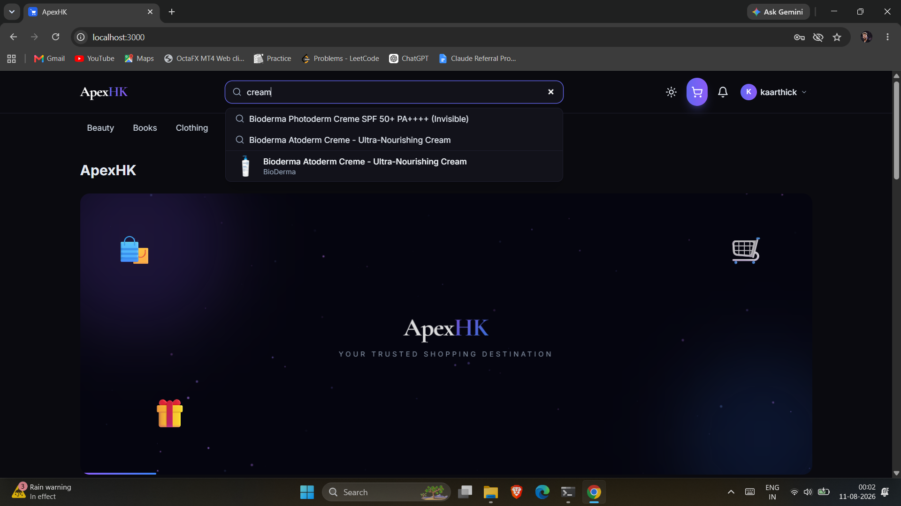
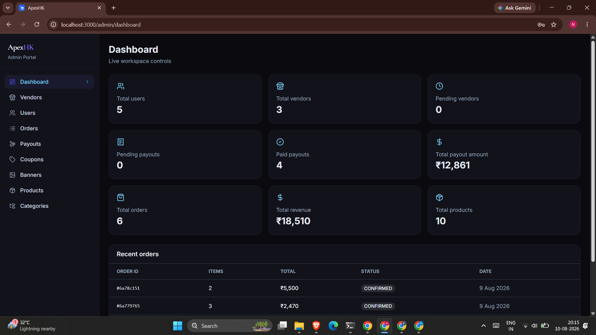

# ApexHK — Multi-Vendor Marketplace

A full-stack multi-vendor e-commerce marketplace built with **Spring Boot, React, TypeScript, MongoDB, and Redis**.

The platform supports customers, vendors, and administrators with separate workflows for product management, payments, orders, vendor fulfillment, returns, refunds, and marketplace operations.


---

## Table of Contents

- [Project Highlights](#-project-highlights)
- [Application Preview](#-application-preview)
- [Complete UI Gallery](#-complete-ui-gallery)
- [Key Features](#-key-features)
- [Architecture](#-architecture)
- [Multi-Vendor Order Architecture](#-multi-vendor-order-architecture)
- [Order Lifecycle](#-order-lifecycle)
- [Return & Refund Workflow](#-return--refund-workflow)
- [Product Search](#-product-search)
- [Payment Flow](#-payment-flow)
- [Technology Stack](#-technology-stack)
- [Project Structure](#-project-structure)
- [Prerequisites](#-prerequisites)
- [Local Setup](#-local-setup)
- [Testing](#-testing)
- [API](#-api)
- [Security](#-security)
- [Docker](#-docker)
- [Deployment Considerations](#-deployment-considerations)
- [Project Status](#-project-status)
- [Future Improvements](#-future-improvements)
- [Contributing](#-contributing)
- [License](#-license)
- [Author](#-author)

---

## 🚀 Project Highlights

ApexHK is designed around a real multi-vendor marketplace workflow where a single customer order can contain products from multiple vendors.

For example:

```
Customer places one order:

Order #123
├── Vendor A
│   ├── Product A
│   └── Product B
└── Vendor B
    └── Product C
```

Each vendor receives and manages only their own products and fulfillment status. This provides vendor-level order isolation instead of treating the entire customer order as one fulfillment unit.

---

## 📸 Application Preview

### Customer Marketplace


### Order Details


### Vendor: Add Product


### Vendor: Return Management


### Admin Dashboard


> The repository contains a complete UI gallery in the `screenshots/`
> directory. The README highlights the most important screens.

---

## 🎨 Complete UI Gallery

The repository contains 30+ screenshots covering:

- Customer experience
- Vendor dashboard
- Product management
- Order management
- Returns and refunds
- Admin management
- Checkout and payments
- Marketplace analytics

See the `screenshots/` directory for the complete UI gallery.

---

## ✨ Key Features

### Customer
- User registration and JWT-based authentication
- Product browsing, search, filtering, and sorting
- Categories and subcategories
- Shopping cart and wishlist
- Checkout with Razorpay payments
- Order tracking, including multi-vendor order tracking
- Product reviews
- Product-specific returns with status tracking
- Refund processing and wallet/credits
- Notifications
- Profile and address management

### Vendor
- Vendor registration with admin approval workflow
- Vendor dashboard
- Product management, including image upload and inventory
- Vendor-specific orders and fulfillment status
- Shipping and tracking information
- OTP-based delivery verification
- Return management (approval/rejection, quality checking)
- Vendor earnings, wallet/payout information
- Subscription management

### Admin
- Admin dashboard
- Customer and vendor management (including approval/rejection)
- Product and category management
- Order and return management
- Refund monitoring
- Vendor earnings/commission monitoring
- Marketplace analytics
- Banner/content management

---

## 🏗️ Architecture

```text
                         ┌──────────────────────┐
                         │       Customer        │
                         └──────────┬────────────┘
                                    │
                                    ▼
┌───────────────────────────────────────────────────────────┐
│                    React + TypeScript (Vite)                │
│  Customer UI  │  Vendor Dashboard  │  Admin Dashboard        │
└──────────────────────────┬──────────────────────────────────┘
                            │ REST / WebSocket
                            ▼
┌───────────────────────────────────────────────────────────┐
│                       Spring Boot API                       │
│  Authentication │ Products │ Cart │ Orders │ Payments        │
│  Vendors │ Returns │ Reviews │ Wallet │ Notifications        │
└──────────────┬──────────────┬──────────────┬────────────────┘
               │              │              │
               ▼              ▼              ▼
          ┌─────────┐    ┌─────────┐   ┌────────────┐
          │ MongoDB │    │  Redis  │   │ Cloudinary │
          └─────────┘    └─────────┘   └────────────┘

                           ┌────────────┐
                           │  Razorpay  │
                           └────────────┘
```

---

## 🛒 Multi-Vendor Order Architecture

A major part of the project is vendor-level order isolation. A single customer order can contain products from multiple vendors, and each `VendorOrder` maintains its own fulfillment status.

```text
Order
│
├── VendorOrder A
│   ├── Product A
│   ├── Product B
│   └── Status: PROCESSING
│
└── VendorOrder B
    ├── Product C
    └── Status: DELIVERED
```

Each vendor can only:
- View their own order items
- Update their own fulfillment status
- Manage their own tracking information
- Process their own returns
- View their own earnings

The parent order maintains an aggregate status for customer/admin views.

---

## 📦 Order Lifecycle

```
PENDING → CONFIRMED → PROCESSING → SHIPPED → OUT_FOR_DELIVERY → DELIVERED
```

Delivery verification uses OTP-based confirmation where applicable.

---

## 🔄 Return & Refund Workflow

Returns are handled at the order-item/vendor level rather than at the entire order level, and support customer appeals when a return is initially rejected.

```text
RETURN_REQUESTED
      ↓
UNDER_REVIEW
      ├── REJECTED
      │      ↓
      │   APPEAL_REQUESTED
      │      ├── FINAL_APPROVED → continue return workflow
      │      └── FINAL_REJECTED → terminal
      ↓
APPROVED
      ↓
PICKUP_SCHEDULED
      ↓
PICKED_UP
      ↓
RECEIVED_AT_WAREHOUSE
      ↓
QUALITY_CHECK
      ├── PASSED → REFUND_INITIATED → REFUNDED
      └── FAILED → REJECTED_POST_QUALITY_CHECK
```

The system supports:
- Product-specific return requests
- Vendor-specific authorization
- 7-day return window
- Return reasons
- Return approval/rejection
- Customer appeals
- Pickup tracking
- Warehouse receipt
- Quality checking
- Refund processing with idempotency protection
- Stock restoration
- Vendor earnings/commission reversal

---

## 🔎 Product Search

The marketplace supports product search across multiple attributes rather than relying only on exact product name matches, including:

- Product name, brand, category, subcategory, description, tags, and SKU (where available)

The search system supports:
- Case-insensitive search
- Partial and multi-word search
- Relevance-based ranking and search suggestions
- Search combined with filtering and pagination

---

## 💳 Payment Flow

```text
Customer → Cart → Checkout → Razorpay → Payment Verification
    → Webhook Confirmation → Order Confirmation → Vendor Orders
```

Payment verification uses server-side validation and webhook handling.

---

## 🛠️ Technology Stack

**Frontend**
- React, TypeScript, Vite
- Tailwind CSS, shadcn/ui
- React Query, Zustand, Axios

**Backend**
- Java, Spring Boot, Spring Security
- JWT authentication
- Spring Data MongoDB
- WebSocket / STOMP
- Maven
- Swagger / OpenAPI

**Database & Infrastructure**
- MongoDB, Redis
- Docker, Docker Compose

**External Services**
- Razorpay (payments)
- Cloudinary (media)
- Email/SMTP

---

## 📁 Project Structure

```text
.
├── marketplace backend/
│   ├── src/
│   ├── .mvn/
│   ├── pom.xml
│   ├── mvnw
│   └── mvnw.cmd
│
├── marketplace-frontend/
│   ├── src/
│   ├── public/
│   ├── package.json
│   ├── package-lock.json
│   └── vite.config.ts
│
├── screenshots/
│   ├── customer/
│   ├── vendor/
│   └── admin/
│
├── docker-compose.yml
├── README.md
└── LICENSE
```

> Environment files containing secrets are intentionally excluded from version control.

---

## ⚙️ Prerequisites

| Tool           | Recommended Version |
|----------------|----------------------|
| Java           | 17+                  |
| Maven          | 3.8+                 |
| Node.js        | 18+                  |
| npm            | 9+                   |
| Docker         | Recent version       |
| Docker Compose | Recent version       |

---

## 🚀 Local Setup

### 1. Clone the repository

### 1. Clone the repository

```bash
git clone https://github.com/repos
cd HarishKaarthick/ApexHK


Place the projects in the expected directory structure shown above.

### 2. Start MongoDB and Redis

From the project root:

```bash
docker compose up -d
```

Verify:

```bash
docker compose ps
```

Default services:
- MongoDB → `localhost:27017`
- Redis → `localhost:6379`

### 3. Configure backend environment variables

Create `marketplace backend/.env`:

```env
JWT_SECRET=your_secure_secret

CLOUDINARY_CLOUD_NAME=
CLOUDINARY_API_KEY=
CLOUDINARY_API_SECRET=

RAZORPAY_KEY_ID=
RAZORPAY_KEY_SECRET=

MAIL_USERNAME=
MAIL_APP_PASSWORD=
```

> Never commit real credentials to GitHub.

### 4. Start the backend

Windows:
```bash
cd "marketplace backend"
mvnw.cmd spring-boot:run
```

Linux/macOS:
```bash
cd "marketplace backend"
./mvnw spring-boot:run
```

- Backend: `http://localhost:8080`
- Swagger UI: `http://localhost:8080/swagger-ui.html`

### 5. Start the frontend

```bash
cd marketplace-frontend
npm install
npm run dev
```

Frontend: `http://localhost:3000`

Frontend environment variables (`.env`):

```env
VITE_API_BASE_URL=http://localhost:8080
VITE_WS_URL=http://localhost:8080/ws
VITE_RAZORPAY_KEY_ID=your_test_key
```


---

## 🧪 Testing

Backend:
```bash
mvn clean test
```

Frontend type checking:
```bash
npx tsc --noEmit
```

Frontend production build:
```bash
npm run build
```

---

## 🔌 API

The backend exposes REST APIs under `/api`.

Swagger/OpenAPI documentation: `http://localhost:8080/swagger-ui.html`

Major API areas include:

```
/api/auth
/api/products
/api/cart
/api/orders
/api/vendor
/api/admin
/api/returns
/api/reviews
/api/payments
```

---

## 🔒 Security

- JWT authentication and role-based authorization
- Server-side vendor authorization and customer ownership validation
- Vendor-level order isolation
- Protected admin endpoints
- Payment verification and webhook verification
- Environment-based secrets (no credentials stored in source code)

---

## 🐳 Docker

Docker Compose is currently used for local infrastructure (MongoDB, Redis). The Spring Boot backend and React frontend can be deployed independently.

---

## 🚀 Deployment Considerations

```text
React/Vite → Frontend Hosting → Spring Boot API → MongoDB / Redis → Razorpay / Cloudinary
```

Production environment variables should be configured through the hosting platform rather than committed to Git.

Before deployment, update:
- API URL and WebSocket URL
- CORS allowed origins
- MongoDB and Redis connections
- Razorpay production keys
- Cloudinary credentials
- Email configuration
- JWT secret

---

## 📊 Project Status

- [x] Authentication
- [x] Customer management
- [x] Vendor management
- [x] Admin management
- [x] Product management
- [x] Cart & checkout
- [x] Razorpay integration
- [x] Multi-vendor orders & order isolation
- [x] Order tracking
- [x] Returns & refunds
- [x] Reviews
- [x] Wallet / earnings
- [x] Notifications
- [x] Product search
- [x] Docker development environment

---

## 🚧 Future Improvements

- Elasticsearch/OpenSearch for large-scale search
- Advanced recommendation and personalization system
- Marketplace analytics dashboard
- Advanced fraud detection
- Automated seller payouts
- Improved observability and monitoring
- Production CDN optimization

---

## 🤝 Contributing

Contributions, issues, and feature requests can be submitted through the GitHub repository.

1. Fork the project
2. Create your feature branch (`git checkout -b feature/amazing-feature`)
3. Commit your changes (`git commit -m 'Add some amazing feature'`)
4. Push to the branch (`git push origin feature/amazing-feature`)
5. Open a pull request

---

## 📄 License

[LICENSE](LICENSE)


---

## 👨‍💻 Author

**Harish Kaarthick**
B.Tech Information Technology

Interested in: Java, Spring Boot, React, full-stack development, backend engineering, and AI/LLM applications.

- LinkedIn: https://www.linkedin.com/in/harish-kaarthick-988b34251/
- GitHub: https://github.com/harishkaarthick
- Email: harishkaarthick@gmail.com